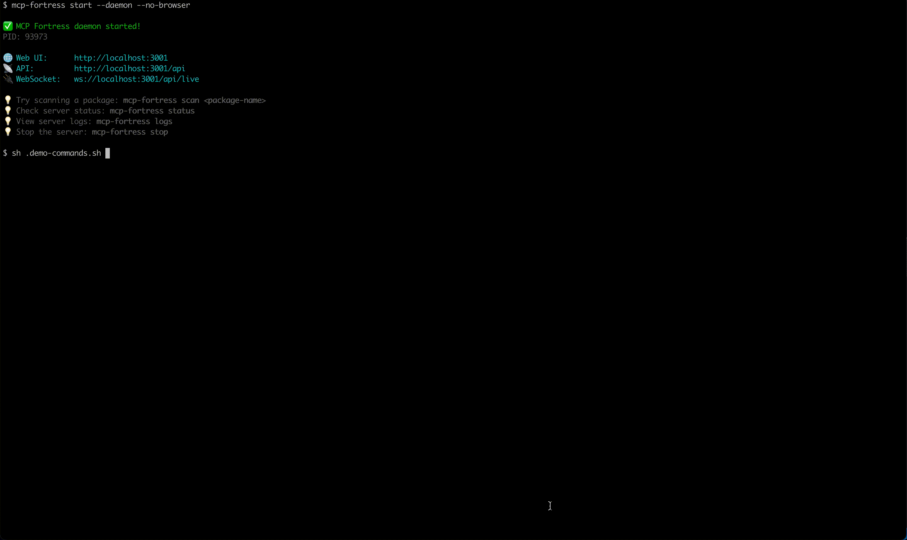

# 🏰 MCP Fortress

**Security scanner and runtime protection for Model Context Protocol (MCP) servers**

[](https://www.npmjs.com/package/mcp-fortress)
[](https://opensource.org/licenses/MIT)

---

## 🚀 Quick Start

```bash
# Install globally
npm install -g mcp-fortress

# Start the server
mcp-fortress start
```

That's it! The web UI will open at `http://localhost:3000`

---

## 🎬 Demo

<p align="center">
  
</p>

---

## ✨ Features

### 🔍 **Automated Security Scanning**
- Vulnerability detection across npm and PyPI packages
- CVE database integration
- Dependency analysis
- Risk scoring (0-100)

### 🛡️ **Runtime Protection**
- Real-time monitoring of MCP servers
- Quarantine suspicious packages
- WebSocket telemetry streaming
- Activity feed with live updates

### 📊 **Gamification**
- Achievement system with 16 unlockable badges
- Streak tracking for daily scans
- Leaderboards and metrics
- Humorous security tips

### 🎨 **Beautiful Web UI**
- Modern React-based dashboard
- Real-time statistics
- Server table with sorting and filtering
- Detailed threat analysis views

---

## 📦 Installation

### Option 1: Global Install (Recommended)

```bash
npm install -g mcp-fortress
mcp-fortress start
```

### Option 2: npx (No Install)

```bash
npx mcp-fortress start
```

---

## 🎯 Usage

### Start the Server

```bash
# Start server (foreground)
mcp-fortress start

# Start server in background (daemon mode)
mcp-fortress start --daemon
```

**Options:**
- `-p, --port <port>` - API port (default: 3001)
- `-h, --host <host>` - Host to bind (default: localhost)
- `--no-browser` - Don't open browser automatically
- `-d, --daemon` - Run server in background

### Daemon Commands

```bash
# Stop the daemon server
mcp-fortress stop

# Check daemon status
mcp-fortress status

# View server logs
mcp-fortress logs
mcp-fortress logs --lines 100  # Show last 100 lines
```

### Scan a Package

```bash
mcp-fortress scan <package-name>
```

**Examples:**
```bash
# Scan from npm
mcp-fortress scan express

# Scan specific version
mcp-fortress scan express --version 4.18.0

# Scan from PyPI
mcp-fortress scan flask --registry pypi
```

### Monitor a Running Server

```bash
mcp-fortress monitor <server-name>
```

### Manage Quarantine

```bash
# List quarantined servers
mcp-fortress quarantine list

# Release from quarantine
mcp-fortress quarantine release <server-name>
```

## 🏗️ Architecture

```
mcp-fortress/
├── CLI                 → Command-line interface
├── API Server          → Express REST API + WebSocket
├── Scanner Engine      → npm & PyPI vulnerability detection
├── Web UI              → React dashboard
└── SQLite Database     → Local data storage
```

**Data Location:**
- `~/.mcp-fortress/fortress.db` - SQLite database
- `~/.mcp-fortress/server.pid` - Daemon process ID
- `~/.mcp-fortress/logs/` - Server logs

---

## 🔐 Security Features

### Threat Detection
- ✅ Known vulnerabilities (CVE database)
- ✅ Suspicious patterns in code
- ✅ Malicious dependencies
- ✅ License compliance issues

### Risk Scoring
- **0-30:** Low risk (green)
- **31-60:** Medium risk (yellow)
- **61-100:** High risk (red)

### Quarantine System
- Automatic blocking of critical threats
- Manual approval workflow
- Audit trail for all actions

---

## 🎮 Gamification

Unlock achievements as you scan:

- 🏆 **First Blood** - Complete your first scan
- 🔥 **Streak Master** - 7-day scanning streak
- 🛡️ **Guardian** - Block 10 high-risk packages
- 🧪 **Lab Rat** - Scan 100 packages
- And 12 more!

## 📊 Tiers

### Free Tier (Local Mode)
- ✅ Unlimited scans
- ✅ Full UI with gamification
- ✅ All achievements
- ✅ Local database
- ✅ No account needed
- ❌ No cloud sync
- ❌ No team features

### Need Pro Tier?
- ✅ Unlimited scans
- ✅ Full UI with gamification
- ✅ All achievements
- ✅ Local database
- ✅ No account needed
- ❌ No cloud sync
- ❌ No team features

**Email:** mcp-fortress@protonmail.com

---

## 🐛 Support

- **Report Issues:** [GitHub Issues](https://github.com/mcp-fortress/mcp-fortress/issues)
- **Discussions:** [GitHub Discussions](https://github.com/mcp-fortress/mcp-fortress/discussions)
- **Email:** mcp-fortress@protonmail.com

---

## 🤝 Contributing

We welcome contributions! Please see [CONTRIBUTING.md](CONTRIBUTING.md) for guidelines.

---

## 📜 License

MIT License - see [LICENSE](LICENSE) file for details.

---

## 🙏 Acknowledgments

Built with:
- [Express](https://expressjs.com/) - Web framework
- [React](https://reactjs.org/) - UI library
- [Better-SQLite3](https://github.com/WiseLibs/better-sqlite3) - Database
- [Commander](https://github.com/tj/commander.js) - CLI framework

---

## 📈 Roadmap

- [ ] Docker container scanning
- [ ] OCI image vulnerability detection
- [ ] SBOM (Software Bill of Materials) generation
- [ ] GitHub Actions integration
- [ ] VS Code extension
- [ ] Cloud sync (Pro tier)

---

**Made with ❤️ for the MCP community**

[](https://github.com/mcp-fortress/mcp-fortress)
